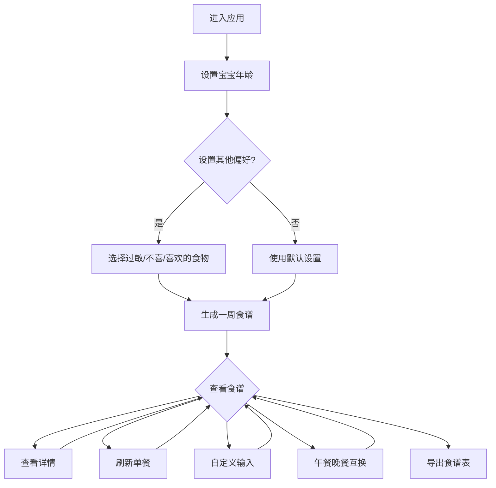

## 1. 产品概述

宝宝食谱定制助手是一款专为宝妈设计的智能食谱推荐应用，帮助家长根据宝宝的年龄、饮食偏好和过敏情况，自动生成营养均衡的一周食谱，让宝宝吃得健康、妈妈省心省力。

- 目标用户：0-6岁宝宝的家长（主要是宝妈）
- 核心价值：解决宝妈"今天给宝宝吃什么"的困扰，提供科学、营养、个性化的食谱方案

## 2. 核心功能

### 2.1 用户角色

| 角色 | 注册方式 | 核心权限 |
|------|----------|----------|
| 宝妈用户 | 无需注册，本地使用 | 设置宝宝信息、生成食谱、自定义食谱、导出食谱表 |

### 2.2 功能模块

1. **设置页面**：宝宝年龄设置、过敏食物选择、不喜欢的食物选择、喜欢的食物选择
2. **食谱生成页面**：一周食谱展示、单餐刷新、自定义输入、午餐晚餐互换
3. **食谱详情弹窗**：食材清单、烹饪步骤、营养提示

### 2.3 页面详情

| 页面名称 | 模块名称 | 功能描述 |
|----------|----------|----------|
| 设置页面 | 年龄选择 | 必填项，选择宝宝年龄段（6-8月、9-11月、1-2岁、2-3岁、3-4岁、4-6岁） |
| 设置页面 | 过敏食物 | 多选，默认无，支持常见过敏原选择（蛋类、海鲜、坚果、牛奶等） |
| 设置页面 | 不喜欢的食物 | 多选，默认无，支持分类选择（蔬菜、肉类、水果等） |
| 设置页面 | 喜欢的食物 | 多选，默认无，支持分类选择 |
| 食谱页面 | 一周食谱表 | 展示周一至周日的午餐、晚餐食谱卡片 |
| 食谱页面 | 单餐刷新 | 点击刷新按钮重新生成该餐食谱 |
| 食谱页面 | 自定义输入 | 弹窗输入自定义菜名、食材、做法 |
| 食谱页面 | 餐次互换 | 拖拽或按钮实现午餐晚餐互换 |
| 食谱详情 | 食材清单 | 展示所需食材及用量 |
| 食谱详情 | 烹饪方法 | 分步骤展示烹饪过程 |
| 食谱详情 | 营养提示 | 展示该菜品适合的年龄段和营养价值 |

## 3. 核心流程

用户首次进入应用，设置宝宝年龄（必填）和其他偏好信息，系统根据设置自动生成一周食谱。用户可以查看每道菜的详细做法，对不满意的餐次进行刷新或自定义输入，也可以将午餐和晚餐互换。最终可以导出或打印完整的一周食谱表。

## 4. 用户界面设计

### 4.1 设计风格

- **主色调**：温暖的珊瑚粉（#FF8A80）搭配柔和的薄荷绿（#B2DFDB），营造温馨、健康的氛围
- **辅助色**：奶白色背景（#FFF8F0）、浅灰色文字（#616161）
- **按钮风格**：圆角胶囊按钮，带有柔和阴影和微动效
- **字体**：标题使用圆润可爱的字体（如"思源黑体 Rounded"），正文使用清晰易读的无衬线字体
- **布局**：卡片式布局，圆角设计，带有可爱的食物图标装饰
- **图标/表情**：使用可爱的食物emoji和手绘风格图标

### 4.2 页面设计概览

| 页面名称 | 模块名称 | UI元素 |
|----------|----------|--------|
| 设置页面 | 年龄选择 | 大按钮组，每个年龄段配有可爱的宝宝图标，选中状态高亮 |
| 设置页面 | 食物选择 | 分类标签页+网格卡片，支持搜索，已选项显示在顶部 |
| 食谱页面 | 一周食谱表 | 周几标签页切换，每日两餐卡片横向排列，卡片显示菜名+缩略图 |
| 食谱页面 | 操作按钮 | 刷新按钮（旋转动画）、互换按钮（拖拽图标）、自定义按钮（编辑图标） |
| 食谱详情 | 详情弹窗 | 居中弹窗，顶部大图，下方食材列表和步骤卡片 |

### 4.3 响应式设计

- 桌面优先设计，最大宽度1200px居中显示
- 移动端适配：卡片单列排列，底部固定操作栏
- 触控优化：按钮点击区域不小于44px，支持滑动手势切换周几

### 4.4 动效设计

- 页面加载：食谱卡片依次淡入上浮
- 刷新动画：按钮旋转，卡片翻转切换新内容
- 互换动画：两张卡片位置交换的平滑过渡
- 弹窗动画：从中心放大淡入，背景模糊