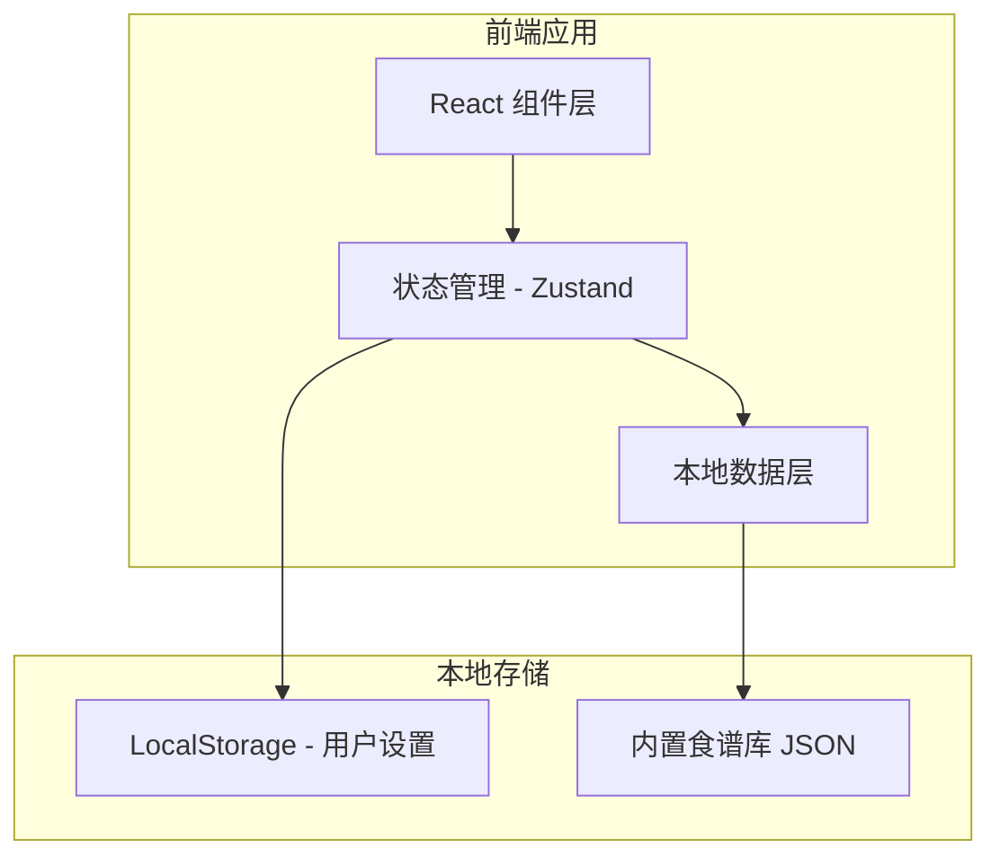

## 1. 架构设计



## 2. 技术说明

- **前端框架**：React 18 + TypeScript
- **样式方案**：Tailwind CSS 3
- **构建工具**：Vite
- **状态管理**：Zustand（轻量级状态管理）
- **动画库**：Framer Motion（流畅的动画效果）
- **图标库**：Lucide React
- **后端服务**：无（纯前端应用，数据存储在本地）
- **数据存储**：LocalStorage + 内置JSON食谱库

## 3. 路由定义

| 路由 | 用途 |
|------|------|
| `/` | 重定向到设置页面 |
| `/setup` | 宝宝信息设置页面 |
| `/recipe` | 一周食谱展示页面 |

## 4. 数据模型

### 4.1 用户设置

```typescript
interface UserSettings {
  babyAge: AgeGroup;           // 宝宝年龄段
  allergies: string[];         // 过敏食物列表
  dislikes: string[];          // 不喜欢的食物列表
  likes: string[];             // 喜欢的食物列表
}

type AgeGroup = '6-8m' | '9-11m' | '1-2y' | '2-3y' | '3-4y' | '4-6y';
```

### 4.2 食谱数据模型

```typescript
interface Recipe {
  id: string;
  name: string;                // 菜名
  ingredients: Ingredient[];   // 食材清单
  steps: string[];             // 烹饪步骤
  ageGroups: AgeGroup[];       // 适合年龄段
  tags: string[];              // 标签（如：补铁、补钙、易消化）
  category: string;            // 分类（蔬菜、肉类、主食等）
  nutrition: string;           // 营养价值描述
  image?: string;              // 图片URL
}

interface Ingredient {
  name: string;
  amount: string;
}

interface WeeklyPlan {
  monday: DayPlan;
  tuesday: DayPlan;
  wednesday: DayPlan;
  thursday: DayPlan;
  friday: DayPlan;
  saturday: DayPlan;
  sunday: DayPlan;
}

interface DayPlan {
  lunch: Recipe;
  dinner: Recipe;
}
```

### 4.3 食谱生成逻辑

```typescript
// 食谱生成算法
function generateWeeklyPlan(settings: UserSettings): WeeklyPlan {
  // 1. 根据年龄段筛选适合的食谱
  // 2. 排除过敏食物相关食谱
  // 3. 降低不喜欢的食物权重
  // 4. 提高喜欢的食物权重
  // 5. 确保一周不重复
  // 6. 均衡营养搭配
}
```

## 5. 项目目录结构

```
src/
├── components/          # 组件目录
│   ├── common/         # 通用组件
│   │   ├── Button.tsx
│   │   ├── Card.tsx
│   │   ├── Modal.tsx
│   │   └── Tag.tsx
│   ├── setup/          # 设置页面组件
│   │   ├── AgeSelector.tsx
│   │   ├── FoodSelector.tsx
│   │   └── SetupPage.tsx
│   └── recipe/         # 食谱页面组件
│       ├── RecipeCard.tsx
│       ├── RecipeDetail.tsx
│       ├── WeeklyPlan.tsx
│       └── RecipePage.tsx
├── data/               # 数据文件
│   └── recipes.ts      # 食谱库数据
├── store/              # 状态管理
│   └── useStore.ts     # Zustand store
├── utils/              # 工具函数
│   ├── recipeGenerator.ts
│   └── storage.ts
├── types/              # TypeScript类型定义
│   └── index.ts
├── App.tsx             # 根组件
├── main.tsx            # 入口文件
└── index.css           # 全局样式
```

## 6. 食谱库设计

### 6.1 食谱分类

- **主食类**：粥、面、饭、馒头等
- **蔬菜类**：各种蔬菜泥、蔬菜汤、炒蔬菜
- **肉类**：鸡肉、猪肉、牛肉、鱼肉
- **蛋类**：蒸蛋、蛋羹、蛋卷
- **汤类**：营养汤、蔬菜汤
- **点心类**：小饼干、蒸糕、布丁

### 6.2 年龄段适配规则

| 年龄段 | 特点 | 食物形态 | 推荐食谱类型 |
|--------|------|----------|--------------|
| 6-8月 | 辅食初期 | 泥糊状 | 米糊、蔬菜泥、果泥 |
| 9-11月 | 咀嚼训练 | 小颗粒、软烂 | 碎菜、肉末、软面条 |
| 1-2岁 | 幼儿期 | 软烂小块 | 软饭、小馄饨、蒸菜 |
| 2-3岁 | 幼儿期 | 正常小块 | 炒菜、饺子、包子 |
| 3-4岁 | 学龄前 | 接近成人 | 正常家常菜 |
| 4-6岁 | 学龄前 | 成人饮食 | 营养均衡餐 |

### 6.3 数据量规划

- 每个年龄段至少 30+ 道食谱
- 总食谱库 200+ 道菜谱
- 涵盖常见食材和营养需求